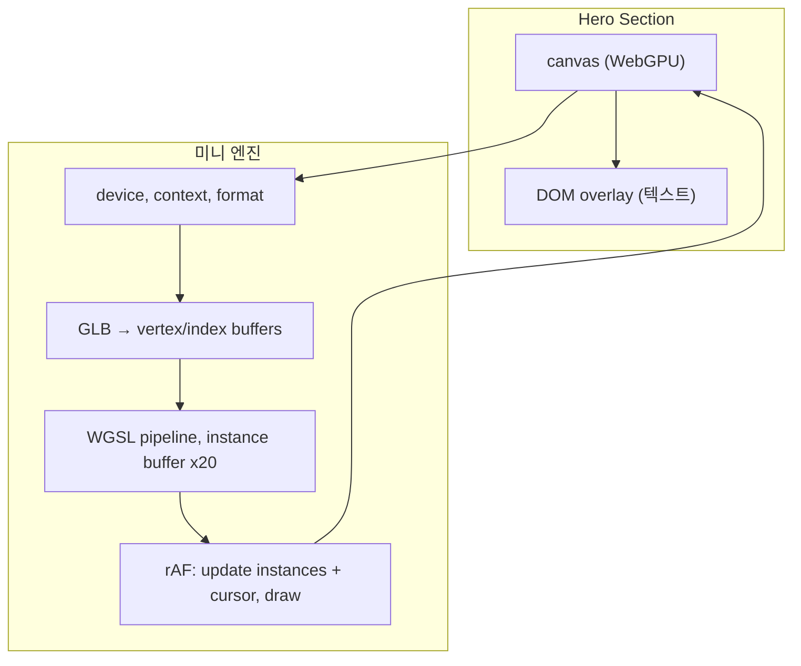

# Hero 3D — 직접 만드는 미니 WebGPU 엔진

## 개요

- **방향**: Three.js / React Three Fiber **미사용**. 순수 **WebGPU API** + 최소 보조 코드만 사용하는 전용 3D 엔진.
- **목표**: Hero 배경에 moon.glb 기준 20개 인스턴스, 축소·부유·커서 반응. 번들·런타임 모두 가볍게 유지.
- **레이어**: 베이스 = 이 엔진이 그리는 캔버스, 상단 = Hero DOM(텍스트 등).

---

## 기술 스택


| 항목                  | 선택                                    |
| ------------------- | ------------------------------------- |
| 렌더링                 | WebGPU (navigator.gpu)                |
| 셰이더                 | WGSL (vertex + fragment)              |
| 모델 로드               | GLB → 경량 파서 또는 소형 라이브러리 (버텍스/인덱스만 추출) |
| React               | 캔버스 ref + useEffect(설정/루프/클린업)        |
| 기존 GlobalCanvas/R3F | Hero 3D에는 사용 안 함 (이 경로만 독립)           |


---

## 아키텍처




- Hero 섹션 안에 **캔버스 1개** (풀스크린 또는 섹션 전체 크기).
- React 컴포넌트가 마운트 시 엔진 초기화(비동기), 언마운트 시 디바이스/버퍼/파이프라인 정리 및 rAF 해제.

---

## 구현 계획

### 1. WebGPU 부트스트랩

- **위치**: 예) `lib/webgpu/` 또는 `components/sections/hero/engine/`.
- **내용**:
  - `navigator.gpu.requestAdapter()` → `adapter.requestDevice()`.
  - 캔버스 `getContext('webgpu')`, `configure()` (device, format, alpha 등).
  - 미지원 시: 캔버스 숨기거나 단색 배경 등 폴백 (WebGL2 폴백은 선택, 없어도 됨).
- **반환**: `{ device, context, format }` 및 크기 변경 시 `context.configure` 재호출.

### 2. GLB 로딩

- **선택지**:
  - **A**: 경량 npm (예: `gltf-parser`, `@gltf-transform/core`의 바이너리 읽기만, 또는 `tinygltf` wasm 등) 로 버텍스/인덱스 추출.
  - **B**: GLB 스펙 최소 구현 (헤더 + JSON + BIN 청크 파싱, accessor/bufferView → Float32Array/Uint16Array). 한 포맷(moon.glb)만 지원하면 코드량 제한 가능.
- **출력**: position(필수), normal(필수), index. UV/머티리얼은 1차에서 단색이라도 되면 생략 가능.
- **버퍼**: `device.createBuffer()` (vertex, index)에 업로드.

### 3. 파이프라인 & 셰이더

- **Vertex stage**:  
  - attribute: position, normal (및 instance당 transform; 또는 instance buffer로 position/scale/rotation).
  - uniform: viewProjection (또는 view + projection 분리).  
  - 출력: clip position, world normal (필요 시), fragment로 전달.
- **Fragment stage**:  
  - 단색 또는 NDC 기반 간단 라이팅. 커서 반응은 uniform으로 넘긴 pointer 사용 가능.
- **인스턴싱**: `drawIndexed(indexCount, instanceCount: 20, ...)`.  
  - 인스턴스별 데이터는 별도 buffer (20 * (4x4 matrix 또는 position + scale + quat 등), 매 프레임 또는 주기적 `queue.writeBuffer`).

### 4. 인스턴스 데이터 & 부유

- **초기 배치**: 20개 위치를 화면 내/깊이 방향으로 랜덤 또는 그리드.
- **스케일**: 전역으로 작게 (예: 0.05~0.15).
- **부유**: 매 프레임 `time` 기반 `sin(time + offset_i) * amplitude` 로 y(및 선택적으로 x/z) 보정.
- **버퍼**: 20개 transform을 담는 GPU 버퍼, 매 프레임 CPU에서 계산 후 `queue.writeBuffer`.

### 5. 커서 반응

- **입력**: `window` 또는 캔버스 `mousemove` (및 터치 시 `touchmove`) → NDC `[-1,1]` 계산.
- **사용**: 
  - **방식 A**: NDC를 uniform으로 전달해 셰이더에서 거리/방향에 따라 색/밝기 변경.
  - **방식 B**: CPU에서 인스턴스 위치를 NDC 쪽으로 살짝 끌어당긴 뒤 instance buffer에 반영 (끌림).
- 첫 단계는 A가 구현 단순. B는 더 “끌리는” 느낌.

### 6. Hero 통합

- **구조**: [components/sections/hero/index.tsx](components/sections/hero/index.tsx)에서:
  - 배경용 `<canvas ref={canvasRef} />` (absolute 등으로 섹션 전체 덮기).
  - 그 위에 기존 section 내용 (텍스트 등).
- **라이프사이클**: `'use client'`, `useEffect`에서:
  - canvas ref 확정 후 WebGPU 초기화(비동기) → GLB 로드 → 파이프라인 생성 → rAF 시작.
  - cleanup: rAF 취소, 버퍼/파이프라인/텍스처 정리, `context.configure({ device: null })` 등.
- **리사이즈**: `ResizeObserver` 또는 `window.resize` 시 context 재설정 + 뷰포트/투영 행렬 갱신.

---

## 폴백

- `navigator.gpu` 없음: 캔버스 미표시 또는 단색/그라데이션 배경만 표시.
- (선택) 로딩 실패: GLB 로드 실패 시 동일 폴백.

---

## 파일 구조 제안

```
lib/webgpu/                    # 또는 components/sections/hero/engine/
  context.ts                   # device, context, format 획득
  glb.ts                       # GLB 파싱 → vertex/index 데이터
  pipeline.ts                  # 셰이더 모듈, pipeline 생성
  types.ts                     # 공용 타입
components/sections/hero/
  index.tsx                   # Hero 섹션 + canvas + overlay
  hero-background.tsx          # 캔버스 ref + useEffect 엔진 붙이는 컴포넌트
  hero.module.css
```

(셰이더는 인라인 문자열 또는 `.wgsl` 로드 중 선택.)

---

## 체크리스트

- WebGPU device/context/캔버스 설정 및 리사이즈 처리
- GLB → vertex/index 버퍼 파이프라인
- WGSL vertex/fragment + 인스턴스 20 draw
- 인스턴스 위치·스케일·부유 애니메이션 (매 프레임 buffer 갱신)
- mousemove/touch → NDC → uniform 또는 instance 데이터 반영
- Hero에 캔버스 배치 및 마운트/언마운트 시 엔진 생성·해제
- WebGPU 미지원 시 폴백 (캔버스 숨김 또는 단색)

